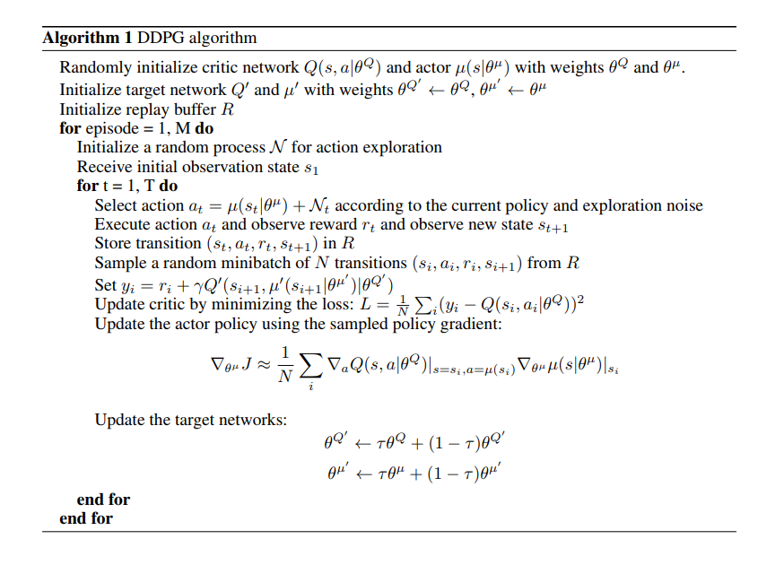
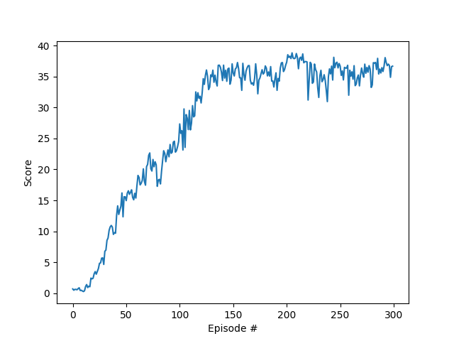
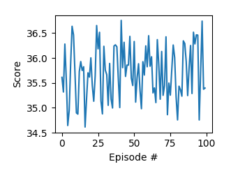

# Udacity Deep Reinforcement Learning Nanodegree Program
## Project 2, Continuous Control

# Vidoes
## [Before Training](https://www.youtube.com/watch?v=BBQH9wjk2pc)
[](https://youtu.be/BBQH9wjk2pc)

## [After Training](https://www.youtube.com/watch?v=Az3UbypBLag)
[](https://youtu.be/Az3UbypBLag)


# The Environment

In this environment, a double-jointed arm can move to target locations. A reward of +0.1 is provided for each step that the agent's hand is in the goal location. Thus, the goal of your agent is to maintain its position at the target location for as many time steps as possible.

The observation space consists of 33 variables corresponding to position, rotation, velocity, and angular velocities of the arm. Each action is a vector with four numbers, corresponding to torque applicable to two joints. Every entry in the action vector should be a number between -1 and 1.

The task is episodic, and in order to solve the environment, **all 20 agents must get an average score of +30 over 100 consecutive episodes**.


# How to run the code
* Download or clone this repository to your home folder.
* Get the simulation (NoVIS)
```
wget https://s3-us-west-1.amazonaws.com/udacity-drlnd/P2/Reacher/Reacher_Linux_NoVis.zip
unzip Reacher_Linux_NoVis.zip
```
* Build with `docker build . --rm -t udrl_docker`
* Run with `run_docker.sh`
* Inside docker - `cd ./UDACITY_DRL_P2/`
* Inside docker - `python continuous_control.py` 


* High-levels parameters (found at the first cell):
```

VIS = False  ## Show/Hide Visual simulation
MANY_AGENTS = True ## Use 1 agent / 20 agents

TRAIN = True  ## perform training
NUM_EPISODES = 250  ## number of epsiodes to train
MAX_T = 1000 ## max time step for each episode
REDUCE_LR = True ## reduce lr while training

TEST = True ## perform testing
LOADNET = False ## load weights from file
ACTORNET_PATH = './checkpoint_actor.pth' ## filename to load weights from 
NUM_EPISODES_TEST = 100 ## number of episodes to test
MAX_T_TEST = 1000  ## max time step for each episode
```


# Report
## Definitions
### State (33) and action (4) space:
```
Unity brain name: ReacherBrain
        Number of Visual Observations (per agent): 0
        Vector Observation space type: continuous
        Vector Observation space size (per agent): 33
        Number of stacked Vector Observation: 1
        Vector Action space type: continuous
        Vector Action space size (per agent): 4
        Vector Action descriptions: , , , 
```

### Solution:
The solution includes an agent trained with Deep Deterministic Policy Gradient (DDPG) approach. In order to do so, I've taken the [DQN model and agent from my first project](https://github.com/amiravni/UDACITY_DRL_P1) and made the needed modification to transform the agent and model to DDPG. The changes were made using refrences from github and the [algorithm from the paper](https://arxiv.org/pdf/1509.02971.pdf)



The changes, in short are as followed:

#### Changes from DQN agent to DDPG

* Init:
	* Added number of agents
	* Added Actor and Critic network instead Q-Network
	* Added noise sampling ang sigma
* Step:
	* Updated replay buffer for N agents
	* Updated learning procedure to be executed every time
* Act:
	* Evaluate states using actor_local network instead Q-network
	* Add noise intead of epsilon-greedy in DQN
* Learn:
	* Instead of DQN learn, we now learn both actor and critic
	* Added critic learn - 
		* Evaluate action_next and evaluate Q(s,a)_next
		* Calculate estimated Q(s,a) (with one-step boot straping)
		* Calculate Q(s,a) from critic local (expected)
		* Calculate the loss
		* Minimize the loss
	* Added actor learn - 
		* Evaluate action
		* Evaluate Q(s,a) using evaluated action
		* Calculate the loss (negative mean of last critic evaluation)
		* Minimize the loss
	* Calculate soft update to actor and critic network instead of Q-network

#### CHANGES from DQN model to DDPG

* Changed to two models - actor and critic
* Actor model - changed final activation function to tanh
* Critic model - added action vector to input, changed output size (1)

#### Changes on main file
* Peripherials changes to run the reacher simulation (and change from jupyter-notebook to py file)


### Agent:

```
BUFFER_SIZE = int(1e6)  # replay buffer size
BATCH_SIZE = 64         # minibatch size
GAMMA = 0.99            # discount factor
TAU = 1e-3              # for soft update of target parameters
UPDATE_EVERY = 1        # how often to update the network

NOISE_SIGMA = 0.1	# Noise sigma
LR_ACTOR = 5e-4		# **INITIAL** learning rate
LR_CRITIC = 5e-3	# **INITIAL** learning rate

```

### Network (ACTOR):
```
    def forward(self, state):
        """Build a network that maps state -> action values."""
        x = F.relu(self.fc1(state))
        x = F.dropout(x,p=0.1)
        x = F.relu(self.fc2(x))
        x = F.dropout(x,p=0.1)
        x = F.relu(self.fc3(x))
        return F.tanh(self.fc4(x))   ## added tanh
```

* fc1: Linear with 33 inputs to 100 outputs
* fc2: Linear with 100 inputs to 100 outputs
* fc3: Linear with 100 inputs to 50 outputs
* fc4: Linear with 50 inputs to 4 outputs
* Dropout with probability of 0.1 after fc1 and fc2

### Network (CRITIC):
```
    def forward(self, state,action):
        """Build a network that maps state and action -> one value"""
        x = torch.cat((state, action), dim=1)
        x = F.relu(self.fc1(x))
        x = F.dropout(x,p=0.1)
        x = F.relu(self.fc2(x))
        x = F.dropout(x,p=0.1)
        x = F.relu(self.fc3(x))
        return self.fc4(x)
```

* fc1: Linear with 37 inputs to 100 outputs
* fc2: Linear with 100 inputs to 100 outputs
* fc3: Linear with 100 inputs to 50 outputs
* fc4: Linear with 50 inputs to 1 outputs
* Dropout with probability of 0.1 after fc1 and fc2


## Learning phase:
```
n_episodes=300
max_t=1000
actor_scheduler = torch.optim.lr_scheduler.StepLR(agents.actor_optimizer, step_size=75, gamma=0.1)
critic_scheduler = torch.optim.lr_scheduler.StepLR(agents.critic_optimizer, step_size=75, gamma=0.1)
```
* The actor learning rate starts from 5e-4 and drops to 10% of its value every 75 episodes
* The critic learning rate starts from 5e-3 and drops to 10% of its value every 75 episodes

Eventually the dynamic and constant learning rate gave similar results which become worth when continued training. The results in the next section are of the constant learning rate but the final results for dynamic learning rate can be found on its folder. Perhaps more tuning is needed.


### Netowrk:
The network final architecture was as described in the definitions. At the begining the network did not converge since the final values of the actor network were not activated with any activation function so the values could be any number. After adding tanh() to the final layer, the values were -1 to 1 and the score started to rise nicely.

### Agent:
DDPG was implemented as described. Different parameters were tested with almost the same results or lower, such as:
* Reducing and Increasing the learning rate and using dynamic learning rate
* Changing noise sigma 


### Learning Phase:
The phase consist of 300 episodes.
This phase with the selected parameters yield the next output



### Test Phase:
At this phase the network only evaluate the predicted action at a given state.
For this phase network with the weights after 200 episodes were used.
This phase yields and average score of ~35.5 - **Meaning the agents was able to receive an average reward (over 100 episodes) of at least +30**. 




## Ideas for future work

* Continue testing the dynamic learning rate approach
* Testing more complex network architecture
* Make more hyperparameter testing, in particular changing some parameters (GAMMA, TAU) to dynamic parameters
